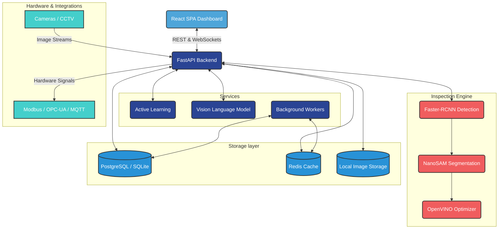
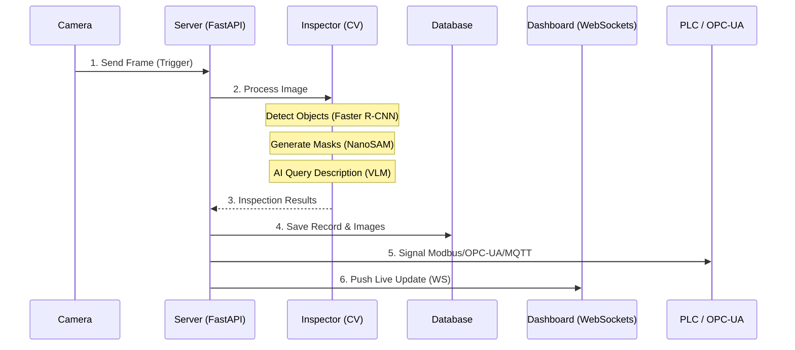

# Ussop — AI Visual Inspection for Manufacturing

> **"I am the Sniper King!"** — Ussop's precision, now for your production line.

Ussop is a production-ready, CPU-based AI visual inspection system that combines object detection (Faster R-CNN) with precise segmentation (NanoSAM) to automate quality control in manufacturing environments.

## 🌟 Key Features

✅ **CPU-Only** — No GPU required, runs on standard industrial PCs
✅ **Fast Deployment** — Hours to deploy, not months
✅ **Precise Segmentation** — SAM masks enable accurate measurements
✅ **Cost-Effective** — 1/3 the price of competitors like Cognex
✅ **Industrial Grade** — Modbus TCP, MQTT, OPC-UA, REST API
✅ **Production Ready** — 70+ API endpoints, JWT auth, audit logging
✅ **React SPA Frontend** — 10-page TypeScript UI, real-time WebSocket dashboard
✅ **Multi-Station** — Centralized overview across all inspection stations
✅ **AI Query** — Natural language questions about your inspection data
✅ **On-Device Retraining** — Fine-tune models from active-learning annotations

---

## 🏗️ Technical Architecture



## 🔄 Inspection Workflow



---

## 🚀 Quick Start

### Option 1: Docker Compose (Recommended)

```bash
cp .env.example .env        # fill in secrets
docker compose -f docker/docker-compose.yml up -d
# API:     http://localhost:8080
# UI:      http://localhost:8080
# Grafana: http://localhost:3001  (admin / admin)
```

### Option 2: Python (Development)

```bash
# 1. Download models
python scripts/download_models.py

# 2. Install dependencies
pip install -e ".[full]"

# 3. Setup database
python scripts/migrate.py upgrade

# 4. Start API
cd ussop && python run.py

# 5. Start frontend dev server (separate terminal)
cd ussop/frontend && npm install && npm run dev

# Access at http://localhost:8080
```

---

## 📁 Project Structure

```text
ussop-project/
├── ussop/                      # Production application package
│   ├── api/                    # FastAPI app + 70+ endpoints
│   ├── services/               # Core domain services (inspector, models, etc.)
│   ├── integrations/           # Modbus TCP, MQTT, Webhooks, OPC-UA server
│   ├── models/                 # SQLAlchemy ORM (9 tables)
│   ├── config/                 # Pydantic settings loading
│   ├── frontend/               # React 18 + TypeScript + Vite SPA
│   ├── tests/                  # 437 tests across 13 files — all passing
│   ├── worker.py               # Background workers (batch, training, alerts)
│   └── run.py                  # Application entry point
├── alembic/                    # Database migrations
├── docs/                       # Comprehensive documentation
├── examples/                   # Reference implementations (legacy ML code)
├── scripts/                    # Utility scripts (download_models.py, migrate.py)
├── docker/                     # Docker configuration (Nginx, Prometheus, Grafana)
├── pyproject.toml              # Dependencies (PEP 517)
├── .env.example                # Configuration template
└── README.md                   # This file
```

---

## 📚 Documentation

| Document | Description |
|---|---|
| [API Reference](docs/api.md) | All REST + WebSocket endpoints |
| [Deployment Guide](docs/deployment.md) | Docker + bare-metal setup |
| [Customer Onboarding](docs/onboarding.md) | 8-step go-live guide |
| [Architecture](docs/architecture.md) | Technical design |
| [Roadmap](docs/plan.md) | Product roadmap |

---

## ⚙️ System Requirements

- **Minimum**: Intel Core i5-10400 (6+ cores), 16GB RAM, 256GB SSD, Win10/Ubuntu 20.04
- **Recommended**: Intel Core i7-12700 (12 cores), 32GB RAM, 512GB NVMe SSD, Ubuntu 22.04 LTS

---

## 🔌 Core API Endpoints

Interactive Swagger docs available at `http://localhost:8080/docs`

| Method | Path | Description |
|---|---|---|
| `POST` | `/api/v1/inspect` | Upload and inspect image |
| `GET` | `/api/v1/inspections` | List inspection history |
| `GET` | `/api/v1/statistics` | Dashboard statistics (cached 30s) |
| `POST` | `/api/v1/query` | Natural language query |
| `POST` | `/api/v1/models/deploy` | Hot-swap inference model |
| `GET` | `/api/v1/opcua/status` | OPC-UA server status |
| `WS` | `/ws/dashboard` | Real-time dashboard push |

---

## 🛠️ Testing & Performance

- **Inference**: < 1s on Intel i5 (MobileNet + NanoSAM)
- **Throughput**: 30+ inspections/minute
- **Accuracy**: > 85% mAP (Detection), > 80% IoU (Segmentation)

```bash
# Run all tests (437 passing tests)
cd ussop
pytest tests/ -v
```

---

## 🤝 Contributing

1. Create a branch: `git checkout -b feature/name`
2. Make changes and test: `pytest tests/ -v`
3. Commit: `git commit -am "Add feature"`
4. Push and open a Pull Request

---

## 📄 License & Support

- **License**: MIT License — See [LICENSE](LICENSE) file for details.
- **Support**: founders@ussop.ai

> **Ussop v2.0** — Sniper precision. Enterprise ready.
> *"Every defect is a target, and we never miss."*
