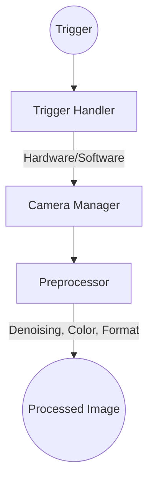
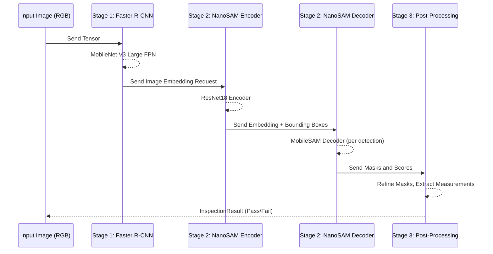
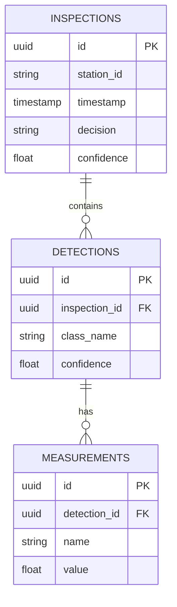
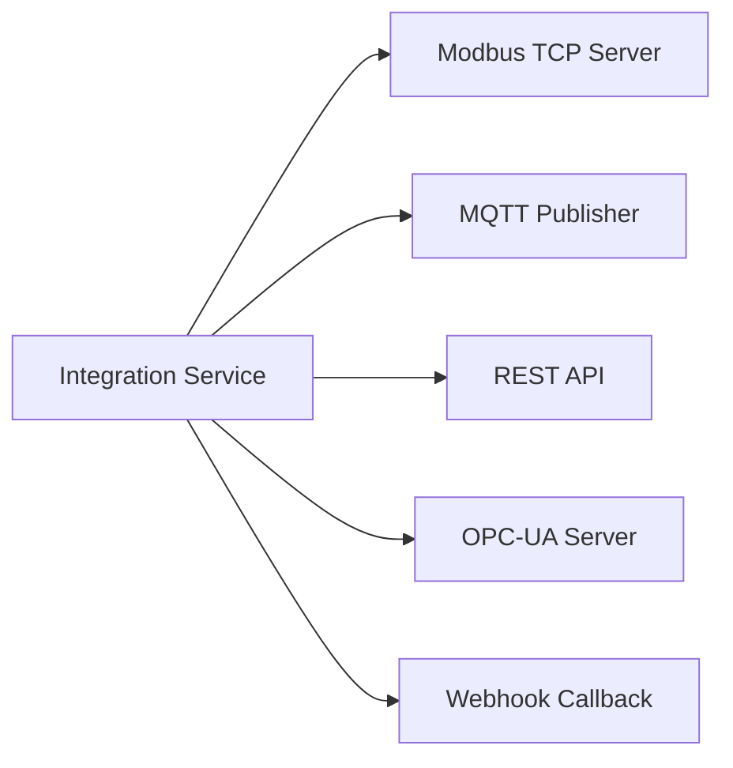
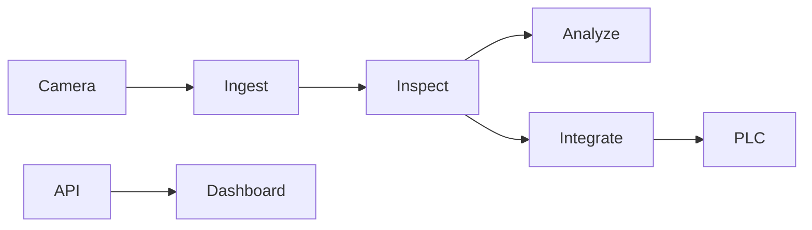
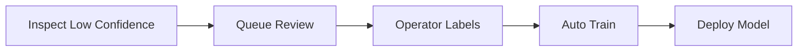
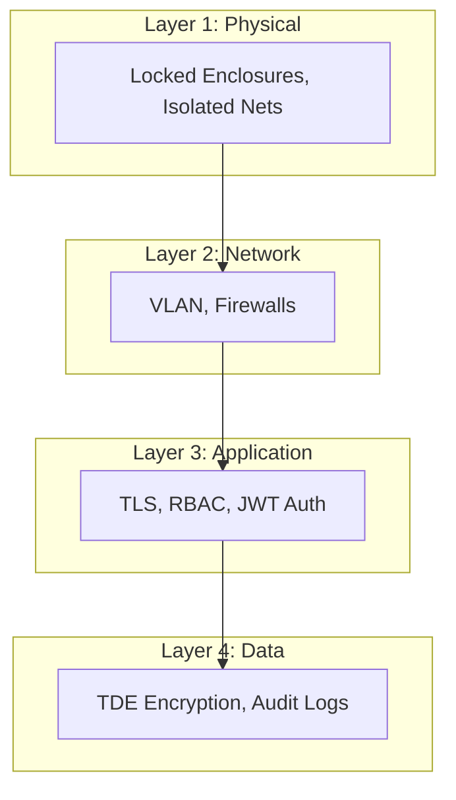

# Ussop — Technical Architecture

> **Sniper-precision defect detection, engineered for production**

---

## 1. Architecture Overview

### 1.1 Design Principles

| Principle | Implementation |
|-----------|----------------|
| **Edge-First** | All inference on local CPU, no cloud dependency |
| **Modular** | Swappable components (detectors, models, integrations) |
| **Scalable** | Single station to enterprise multi-site |
| **Observable** | Comprehensive logging, metrics, tracing |
| **Secure** | Defense in depth, encryption, audit trails |

### 1.2 System Context

```mermaid
graph TD
    classDef ext fill:#f9f9f9,stroke:#333,stroke-width:2px,stroke-dasharray: 5 5;
    classDef ussop fill:#e1f5fe,stroke:#0288d1,stroke-width:2px;
    classDef core fill:#b3e5fc,stroke:#0277bd,stroke-width:1px;

    subgraph External Systems
        PLC[PLC (Modbus)]:::ext
        MES[MES (API)]:::ext
        QMS[QMS (API)]:::ext
        Cloud[Cloud (Optional)]:::ext
    end

    subgraph Ussop Platform
        Gateway[API Gateway Nginx/FastAPI]:::ussop
        
        subgraph Core Services
            Ingest[Ingest Service]:::core
            Inspect[Inspect Service]:::core
            Analyze[Analyze Service]:::core
            Integrate[Integrate Service]:::core
        end

        MQ[(Message Bus Redis/RabbitMQ)]:::core
        
        subgraph Data Stores
            Engine[Model Engine ONNX RT]:::core
            DB[(Data Store PostgreSQL)]:::core
            Cache[(Config Store Redis)]:::core
            Metrics[(Metrics Store Prometheus)]:::core
        end
    end

    subgraph Hardware Layer
        Cam[Camera USB/GigE]:::ext
        Light[Lighting 24V]:::ext
        IO[Digital I/O]:::ext
    end

    PLC <--> Gateway
    MES <--> Gateway
    QMS <--> Gateway
    Cloud <--> Gateway

    Gateway <--> Ingest
    Gateway <--> Inspect
    Gateway <--> Analyze
    Gateway <--> Integrate

    Ingest --> MQ
    Inspect --> MQ
    Analyze --> MQ
    Integrate --> MQ

    MQ --> Engine
    MQ --> DB
    MQ --> Cache
    MQ --> Metrics

    Cam --> Ingest
    Light --> PLC
    IO --> PLC
```

---

## 2. Core Services

### 2.1 Ingest Service

**Purpose:** Capture and preprocess images from cameras



### 2.2 Inspection Service

**Purpose:** Run detection and segmentation models



**Optimization Profile:**

| Technique | Benefit | Implementation |
|-----------|---------|----------------|
| INT8 Quantization | 2x speedup, 75% size | ONNX Runtime quantization |
| Dynamic Axes | Variable batch/input size | ONNX dynamic shapes |
| Thread Tuning | Maximize CPU utilization | `intra_op_num_threads=0` |

---

### 2.3 Analysis Service

**Purpose:** Analytics, trending, and reporting



---

### 2.4 Integration Service

**Purpose:** Connect to external systems (PLCs, MES, APIs)



---

## 3. Data Flow Diagrams

### 3.1 Typical Inspection Flow



### 3.2 Active Learning Flow



### 3.3 Multi-Station Deployment

```mermaid
graph TD
    subgraph Cloud [Cloud (Optional)]
        Model[(Model Repo)]
        Ana[Analytics Dashboard]
    end

    subgraph Factory [Factory Network]
        GW[Edge Gateway]
        
        S1[Station 1]
        S2[Station 2]
        S3[Station 3]
        
        GW --> S1
        GW --> S2
        GW --> S3
    end

    Cloud <-->|VPN / Internet| Factory
```

---

## 4. Security Architecture

### Defense in Depth



---

**Document Version:** 1.0  
**Last Updated:** March 2026  
**Owner:** Ussop Engineering Team
